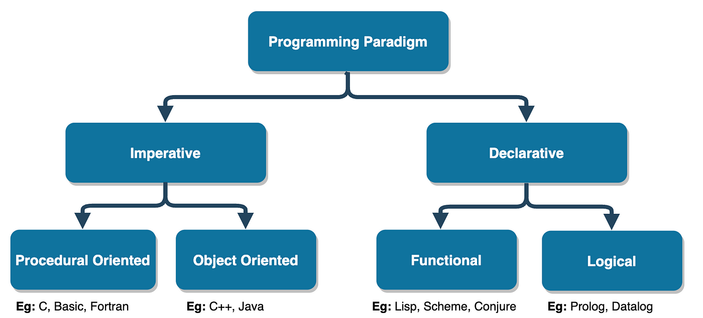
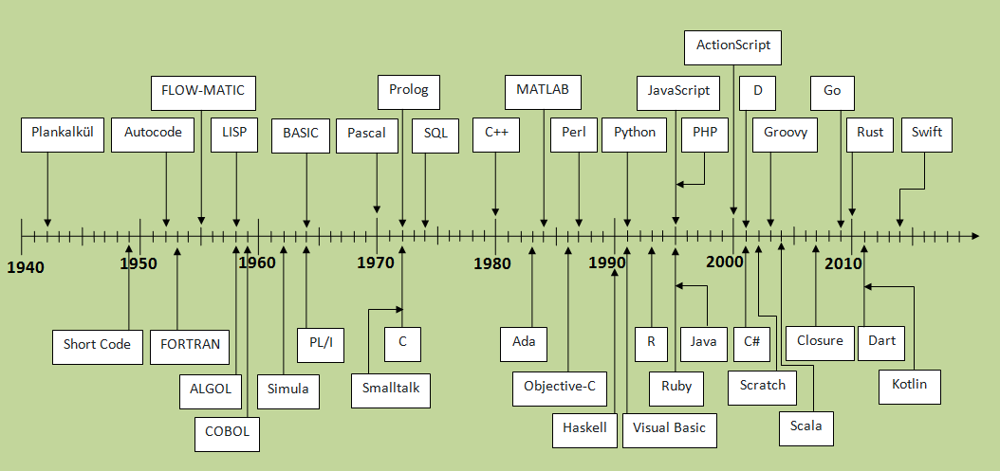
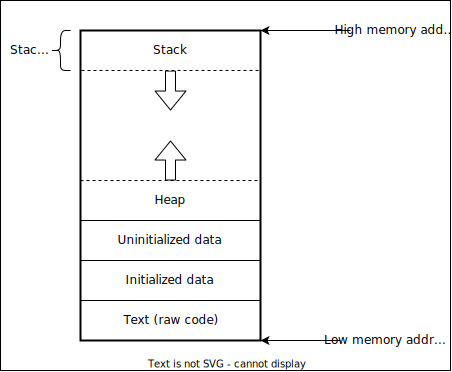
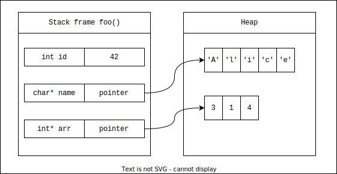

<style>
h1 {
  text-align: center;
}
</style>

<h1> Rust Workshop - ADSAI </h1> 


---
<!-- paginate: true -->

## Plan for today:

- 1 hour presentation to **motivate** and **explain** Rust
- Coffee break
- 2 hours hands-on working on Rust mini-project

---

# What is Rust?

Rust is a programming language focusing on: 
- **Speed**
- **Memory safety** 
- **Concurrency**

---

<div class="columns">
<div>

## Multi-paradigm styles

- Pure-functional 
- Imperative-procedural
- Object-oriented 

</div>
<div>



</div>
</div>


---

<style>
  div.trim {
    max-height:500px;
    max-width: 1000px;
    overflow: hidden;
    display: block;
    margin:0 auto;
 }
</style>

## [StackOverflow developer survey 2024](https://survey.stackoverflow.co/2024/technology#2-programming-scripting-and-markup-languages)

<div class="trim">

</div>

---

# A little more motivation is needed

- What do we mean by memory safety?
- Let's go back in time...

---

# Age old problem of memory safety




---

# Refresher on the Stack and Heap


---




--- 




--- 

## Example in C

```c
void foo(){
  ...
  int id = 42;  // stack allocation
  
  char* name = malloc(sizeof(char) * 5); // heap allocation
  memcpy(name, "Alice", 5);

  int* arr = malloc(sizeof(int) * 3); // heap allocation
  arr[0] = 3;
  arr[1] = 1;
  arr[2] = 4;
  ...
}
```

---
## Example in C
```c
void foo(){
  ...
  int id = 42;  // stack allocation
  
  char* name = malloc(sizeof(char) * 5); // heap allocation
  memcpy(name, "Alice", 5);

  int* arr = malloc(sizeof(int) * 3); // heap allocation
  arr[0] = 3;
  arr[1] = 1;
  arr[2] = 4;
  ...
  free(name); free(arr); // solution
}
```

---

# Examples of memory safety errors:
## Use-after-free

```c
void foo(){
  ...
  char* name = malloc(sizeof(char) * 5); // heap allocation
  memcpy(name, "Alice", 5);
  ...
  free(name); // free name pointer
  ...
  register_in_database(name); // use after free error
}
```
---

# Examples of memory safety errors:
## Buffer overflow

```c
void foo(){
  ...
  int* arr = malloc(sizeof(int) * 3); // heap allocation
  arr[0] = 3;
  arr[1] = 1;
  arr[2] = 4;
  arr[3] = 2; // out-of-bound writes may corrupt adjacent memory
  ...
  free(arr); // free arr pointer
}
```
---

# Examples of memory safety errors:
## Uninitialized variables

```c
void foo(){
  ...
  char* name = malloc(sizeof(char) * 5); // heap allocation
  register_in_database(name); // forgot to initialize name
  ...
  free(name); // free name pointer
  ...
}
```
---

# Examples of memory safety errors:
## Null pointer dereference

```c
void foo(){
  ...
  char* name = malloc(sizeof(char) * 5); // heap allocation
  ...
  name = NULL; // name points to unvalid data
  ...
  char first_letter = *name // NULL pointer dereference
  ...
}
```
---

# How do other languages deal with memory safety?
 
---

## Garbage Collector
- Second process runs alongside your program
- During runtime, collect and free unused memory
- Difficult to predict when memory will be cleaned
- Comes at the expense of performance overhead
- e.g., Java, Go, JavaScript, Python, Ruby

---

# Example: [Why Discord switched from Go to Rust](https://discord.com/blog/why-discord-is-switching-from-go-to-rust)

- CPU spikes roughly every 2 minutes 
- Go forces Gargabe Collector to run at a minimum every 2 minutes


---

# Example: [Why Discord switched from Go to Rust](https://discord.com/blog/why-discord-is-switching-from-go-to-rust)

- Go team switched to Rust (no Garbage Collector)
- (Rust in blue, Go in purple) 


---

## Enforce immutable state
- Do not let users manipulate state/memory
- Functional programming paradigm
- Only pure functions $f: A \rightarrow B$
- No side effects (memory or I/O)
- e.g., Haskell, Lisp, Erlang, F#

---

## Enforce object-orientation
- Encapsulate state in objects
- Constructor/destructor to allocate/free memory
- e.g., Java, C++

---

# Indirect solution to the problem at hand

---

# Rust's solution: the borrow checker

## Ownership rules
- Each value in Rust has an owner
- There can only be one owner at a time
- When the owner goes out of scope, the value will be dropped

---

## The String type in Rust

Two string types in Rust
- `&str` is a hardcoded string literal in the text of the program
```rust
let s_lit = "hello"; // string literal stored on the stack
```
- `String` is an owned growable data type stored on the heap
```rust
let s = String::from("hello"); // owned String type
s.push_str(", world!"); // push_str() appends a literal to a String
```

---

## Variable scope in Rust

```rust
{                      // s is not valid here, it’s not yet declared
    let s = String::from("hello");   // s is valid from this point forward

    // do stuff with s
}                      // this scope is now over, and s is no longer valid
```
---

## Moving ownership
```rust
let s1 = String::from("hello");
let s2 = s1;
```


---

## Moving ownership
```rust
let s1 = String::from("hello");
let s2 = s1;
```


---

## Moving ownership
```rust
let s1 = String::from("hello");
let s2 = s1;
```


---

## Name example

```rust
let name = String::from("alice"); // 'name' owns data
let capitalized_name = capitalize(name); // ownership moved

println!(capitalized_name); // Ok
println!(name); // error: 'name' moved
```

---

## Library example

```rust
let frankenstein = Book {};

loan_to_alice(&frankenstein); // borrow 
loan_to_bob(&frankenstein); // borrow 

// Still owner of 'frankenstein'

withdraw_book(frankenstein); // give up ownership to function

// Not allowed to use 'frankenstein' anymore

loan_to_charlie(&frankenstein); // error: 'frankenstein' moved
```

---

## Author example

```rust
let frankenstein = Manuscript {};

let penguin_books = Editor {};
let alice = Editor {};

edit(&mut frankenstein, penguin_books); // mutable borrow 
edit(&mut frankenstein, alice); // error: only one mut borrow 

// Still owner of 'frankenstein'

sell_book(frankenstein); // pass ownership

// Not allowed to use 'frankenstein' anymore

loan_to_bob(&frankenstein); // error: 'frankenstein' moved
```

---

## Rust compiler
- **Deep understanding** of your program's *memory*
$\rightarrow$ **deep understanding** of your program's *code*
- **Learning curve**: 
  - Fight with borrow checker at first
  - Compiler is your best friend!
- What you get in return: 
  - Memory safety guarantees
  - Blazing Performance

---

> # In rust, you tell the compiler how the world works. It will hold you and everyone who contributes to your code accountable to the contract you have written.

---

# No Error

JavaScript:
```javascript
let spam = ['cat', 'dog', 'mouse']
console.log(spam[6])
``` 
- No output
- No error's
- Just an `undefined`

---

# Bad Error

Python:
```python
spam = ['cat', 'dog', 'mouse']
print(spam[6])
``` 
Python ~~error~~ traceback
```
Traceback (most recent call last):
  File "segfaults.py", line 2, in <module>
    print(spam[6])
IndexError: list index out of range
```

---

# Good Error

Rust:
```rust
let spam = ["cat", "dog", "mouse"];
println!("{}", spam[6])
``` 
Rust error ~~traceback~~
```rust
error: this operation will panic at runtime
 --> no_segfaults.rs:2:15
  |
2 |     println!("{}", spam[6]);
  |                    ^^^^^^^ index out of bounds: 
        the length is 3 but the index is 6
```

---

```rust
fn main() {
    let text = "Hello World";
    println!(text);
}
```

```rust
 --> src/main.rs:4:14
  |
4 |     println!(text);
  |              ^^^^
  |
help: you might be missing a string literal to format with
  |
4 |     println!("{}", text);
  |              +++++
```

---
```rust
fn main() {
    let text = "Hello World";
    modify_text(text);
    println!("{}", text);
}
fn modify_text(v: &str) {
    v = "Heya";
}
```

```rust
error[E0384]: cannot assign to immutable argument `v`
 --> src/main.rs:8:5
  |
8 |     v = "Heya";
  |     ^^^^^^^^^^ cannot assign to immutable argument
  |
help: consider making this binding mutable
  |
7 | fn modify_text(mut v: &str) {
  |                +++
```

---

```rust
fn main() {
    let mut text: String = "Hello World".to_string();
    modify_text(text);
    println!("{}", text);
}

fn modify_text(mut v: String) {
    v = "Heya".to_string();
}
```

---

```rust
error[E0382]: borrow of moved value: `text`
 --> src/main.rs:4:20
  |
2 |     let mut text: String = "Hello World".to_string();
  |         -------- move occurs because `text` has type `String`, 
                     which does not implement the `Copy` trait
3 |     modify_text(text);
  |                 ---- value moved here
4 |     println!("{}", text);
  |                    ^^^^ value borrowed here after move
  |
note: consider changing this parameter type in function `modify_text` to
borrow instead if owning the value isn't necessary
 --> src/main.rs:7:23
  |
7 | fn modify_text(mut v: String) {
  |    -----------        ^^^^^^ this parameter takes ownership of the value
  |    |
  |    in this function
  = note: this error originates in the macro `$crate::format_args_nl` which
    comes from the expansion of the macro `println`
help: consider cloning the value if the performance cost is acceptable
  |
3 |     modify_text(text.clone());
  |                     ++++++++

```

---

## Consuming
```rust
fn main() {
    let text: String = "Hello World".to_string();
    modify_text(text.clone());
    println!("{}", text);
}

fn modify_text(mut v: String) {
    v = "Heya".to_string();
}
```

---

## Mutable reference
```rust
fn main() {
    let mut text: String = "Hello World".to_string();
    modify_text(&mut text);
    println!("{}", text);
}

fn modify_text(v: &mut String) {
    v.push_str("!!!!");
}
```

---

## Returning
```rust
fn main() {
    let mut text: String = "Hello World".to_string();
    text = modify_text(text);
    println!("{}", text);
}

fn modify_text(v: String) -> String {
    v + "!!!!"
}
```

---

# Is this funtion correct?

```rust
function add_one(n) {
    return n + 1;
}
``` 
...it depends

---

# Is this funtion correct?

```rust
function add_one(n) {
    return n + 1;
}
``` 
...it depends, on:
- Is `n` always a number?
- How large is `n`?
- Could `n` be modified while we're reading its value?
- and so on...

---

# Options Everywhere

You can't always get want you want
```rust
enum Option<T> { // T can contain any type of value
    Some(T),
    None,
}

let possibly_a_number = Some(1);
possibly_a_number.unwrap_or(0); // = 1

let another_number = None;
another_number.unwrap_or(0); // = 0
```

---

# Results Everywhere

When things go south, you need another route
```rust
enum Result<T, E> { 
    Ok(T), // T can contain any type of value
    Err(E), // E can contain any type of Error
}
```

---
# Let's compair
python:
```python
int(item["ViewCount"]["N"])
```
Rust:
```rust
i32::from_str_radix(
    item["ViewCount"].unwrap()
        .get("N").unwrap(),
    10
).unwrap()
```

---


# A verbose rust solution

```rust
if let Some(view_count_attr) = item.get("ViewCount") {
    match view_count_attr.get("N") {
        Ok(view_count) => {
            match i32::from_str_radix(view_count, 10) {
                Ok(n) => n,
                Err(_) => {
                    // We couldn't parse the string as an i32
                }
            }
        }
        Err(_) => {} // There is no 'N' attribute
    }
} else {} // There is no 'ViewCount' attribute

```

---

# An idiomatic rust solution

```rust
fn some_function() -> Result<i32> {
    let viewcount = item.get("ViewCount")?;
    let n_value = viewcount.get("N")?;
    let n = i32::from_str_radix(n_value, 10)?;
    n
}
```

---

# Enums
```rust
enum Result {
    Ok(T),
    Err(E)
}

let success = Result::Ok(42);
```
- More powerful than C-style enums
- Can contain data
- Compiler ensures all cases handled

---

# Structs
```rust
struct User {
    username: String,
    email: String,
    active: bool
}

let user = User {
    username: String::from("rust_fan"),
    email: String::from("rust@example.com"),
    active: true
};
```
---
```rust
struct FileMetas {
    pub files: Vec<(FileOperation, FileMeta)>,
}
enum FileOperation {
    Create,
    Modify,
    Remove,
    Indexed
}
struct FileMeta {
    pub path: String,
    pub file: bool,
    pub size: u64,
    pub premissions: u32,
    pub modified: u64,
    pub accessed: u64,
    pub created: u64,
    pub hash: Option<String>,
}
```

---

# Struct functionality impl

```rust
struct Example {
    number: i32,
}

impl Example {
    fn boo() {
        println!("boo! Example::boo() was called!");
    }

    fn answer(&mut self) {
        self.number += 42;
    }

    fn get_number(&self) -> i32 {
        self.number
    }
}
```
---

# Expressions Over Statements
```rust
let value = if condition {
    compute_something()
} else {
    compute_other()
};

// Even blocks are expressions
let result = {
    let x = 1;
    x + 1  // No semicolon = return value
};
```

---

# Iterators: Zero-Cost Abstractions
```rust
let squares: Vec<i32> = (0..5)
    .map(|x| x * x)
    .filter(|x| x % 2 == 0)
    .collect();

// As efficient as hand-written loops
```

---

# Pattern Matching
```rust
match value {
    0 => println!("Zero"),
    1 | 2 => println!("One or Two"),
    3..=9 => println!("Three to Nine"),
    _ => println!("Something else")
}

match optional_value {
    Some(x) => println!("Found: {}", x),
    None => (), // Do nothing
}
```

---

# Traits: Interface Definitions
```rust
trait Display {
    fn fmt(&self, f: &mut Formatter) -> Result;
}

impl Display for User {
    fn fmt(&self, f: &mut Formatter) -> Result {
        write!(f, "{} ({})", self.username, self.email)
    }
}
```

---

# Generics: Zero-Cost Abstraction
```rust
struct Queue<T> {
    items: Vec<T>
}

impl<T> Queue<T> {
    fn push(&mut self, item: T) {
        self.items.push(item)
    }
}

// Monomorphization: No runtime cost
```

---

# Overflow

```rust
let mut test: u8 = 0;
loop {
    test += 1
    println!("{}", test);
}
```

---

# Overflow

```rust
let mut test: u8 = 0;
loop {
    test = match test.checked_add(1) {
        Some(x) => x,
        None => break,
    };
    println!("{}", test);
}
println!("We almost had an overflow");
```

---

## Rust compiler, won't let you crash


---

# Cargo 
```bash
cargo new hello_world
$ cd hello_world
$ tree .
.
├── Cargo.toml
└── src
    └── main.rs
$ cargo run
$ cargo run --release
```

---

# Cargo 
```bash
# Add a simple dependency
cargo add serde

# Add a specific version
cargo add tokio@1.28.0

# Add with version requirements
cargo add regex@^1.5
cargo add chrono@~4.0.0

# Add multiple crates at once
cargo add serde serde_json tokio

# Add with specific features enabled
cargo add tokio --features full
cargo add serde --features derive,rc
```
---