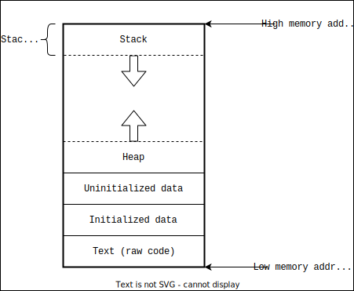

<style>
h1 {
  text-align: center;
}
</style>

<h1> Rust Workshop - ADSAI </h1> 


---
<!-- paginate: true -->

## Plan for today:

- 1 hour presentation to **motivate** and **explain** Rust
- Coffee break
- 2 hours hands-on working on Rust mini-project

---

# What is Rust?

Rust is a programming language focusing on: 
- **Speed**
- **Memory safety** 
- **Concurrency**

---

<div class="columns">
<div>

## Multi-paradigm styles

- Pure-functional 
- Imperative-procedural
- Object-oriented 

</div>
<div>


</div>
</div>


---

<style>
  div.trim {
    max-height:500px;
    max-width: 1000px;
    overflow: hidden;
    display: block;
    margin:0 auto;
 }
</style>

## [StackOverflow developer survey 2024](https://survey.stackoverflow.co/2024/technology#2-programming-scripting-and-markup-languages)

<div class="trim">

</div>

---

# A little more motivation is needed

- What do we mean by memory safety?
- Let's go back in time...

---

# Age old problem of memory safety


---

# Refresher on the Stack and Heap


---




--- 


--- 

## Example in C

```c
void foo(){
  ...
  int id = 42;  // stack allocation
  
  char* name = malloc(sizeof(char) * 5); // heap allocation
  memcpy(name, "Alice", 5);

  int* arr = malloc(sizeof(int) * 3); // heap allocation
  arr[0] = 3;
  arr[1] = 1;
  arr[2] = 4;
  ...
}
```

---
## Example in C
```c
void foo(){
  ...
  int id = 42;  // stack allocation
  
  char* name = malloc(sizeof(char) * 5); // heap allocation
  memcpy(name, "Alice", 5);

  int* arr = malloc(sizeof(int) * 3); // heap allocation
  arr[0] = 3;
  arr[1] = 1;
  arr[2] = 4;
  ...
  free(name); free(arr); // solution
}
```

---

# Examples of memory safety errors:
## Use-after-free

```c
void foo(){
  ...
  char* name = malloc(sizeof(char) * 5); // heap allocation
  memcpy(name, "Alice", 5);
  ...
  free(name); // free name pointer
  ...
  register_in_database(name); // use after free error
}
```
---

# Examples of memory safety errors:
## Buffer overflow

```c
void foo(){
  ...
  int* arr = malloc(sizeof(int) * 3); // heap allocation
  arr[0] = 3;
  arr[1] = 1;
  arr[2] = 4;
  arr[3] = 2; // out-of-bound writes may corrupt adjacent memory
  ...
  free(arr); // free arr pointer
}
```
---

# Examples of memory safety errors:
## Uninitialized variables

```c
void foo(){
  ...
  char* name = malloc(sizeof(char) * 5); // heap allocation
  register_in_database(name); // forgot to initialize name
  ...
  free(name); // free name pointer
  ...
}
```
---

# Examples of memory safety errors:
## Null pointer dereference

```c
void foo(){
  ...
  char* name = malloc(sizeof(char) * 5); // heap allocation
  ...
  name = NULL; // name points to unvalid data
  ...
  char first_letter = *name // NULL pointer dereference
  ...
}
```
---

# How do other languages deal with memory safety?
 
---

## Garbage Collector
- Second process runs alongside your program
- During runtime, collect and free unused memory
- Difficult to predict when memory will be cleaned
- Comes at the expense of performance overhead
- e.g., Java, Go, JavaScript, Python, Ruby

---

# Example: [Why Discord switched from Go to Rust](https://discord.com/blog/why-discord-is-switching-from-go-to-rust)

- CPU spikes roughly every 2 minutes 
- Go forces Gargabe Collector to run at a minimum every 2 minutes


---

# Example: [Why Discord switched from Go to Rust](https://discord.com/blog/why-discord-is-switching-from-go-to-rust)

- Go team switched to Rust (no Garbage Collector)
- (Rust in blue, Go in purple) 


---

## Enforce immutable state
- Do not let users manipulate state/memory
- Functional programming paradigm
- Only pure functions $f: A \rightarrow B$
- No side effects (memory or I/O)
- e.g., Haskell, Lisp, Erlang, F#

---

## Enforce object-orientation
- Encapsulate state in objects
- Constructor/destructor to allocate/free memory
- e.g., Java, C++

---

# Indirect solution to the problem at hand

---

# Rust's solution: the borrow checker

## Ownership rules
- Each value in Rust has an owner
- There can only be one owner at a time
- When the owner goes out of scope, the value will be dropped

---

## The String type in Rust

Two string types in Rust
- `&str` is a hardcoded string literal in the text of the program
```rust
let s_lit = "hello"; // string literal stored on the stack
```
- `String` is an owned growable data type stored on the heap
```rust
let s = String::from("hello"); // owned String type
s.push_str(", world!"); // push_str() appends a literal to a String
```

---

## Variable scope in Rust

```rust
{                      // s is not valid here, it’s not yet declared
    let s = String::from("hello");   // s is valid from this point forward

    // do stuff with s
}                      // this scope is now over, and s is no longer valid
```
---

## Moving ownership
```rust
let s1 = String::from("hello");
let s2 = s1;
```


---

## Moving ownership
```rust
let s1 = String::from("hello");
let s2 = s1;
```


---

## Moving ownership
```rust
let s1 = String::from("hello");
let s2 = s1;
```


---

## Name example

```rust
let name = String::from("alice"); // 'name' owns data
let capitalized_name = capitalize(name); // ownership moved

println!(capitalized_name); // Ok
println!(name); // error: 'name' moved
```

---

## Library example

```rust
let frankenstein = Book {};

loan_to_alice(&frankenstein); // borrow 
loan_to_bob(&frankenstein); // borrow 

// Still owner of 'frankenstein'

withdraw_book(frankenstein); // give up ownership to function

// Not allowed to use 'frankenstein' anymore

loan_to_charlie(&frankenstein); // error: 'frankenstein' moved
```

---

## Author example

```rust
let frankenstein = Manuscript {};

let penguin_books = Editor {};
let alice = Editor {};

edit(&mut frankenstein, penguin_books); // mutable borrow 
edit(&mut frankenstein, alice); // error: only one mut borrow 

// Still owner of 'frankenstein'

sell_book(frankenstein); // pass ownership

// Not allowed to use 'frankenstein' anymore

loan_to_bob(&frankenstein); // error: 'frankenstein' moved
```

---

## Rust compiler
- **Deep understanding** of your program's *memory*
$\rightarrow$ **deep understanding** of your program's *code*
- **Learning curve**: 
  - Fight with borrow checker at first
  - Compiler is your best friend!
- What you get in return: 
  - Memory safety guarantees
  - Blazing Performance

<!-- 
# In rust, you tell the compiler how the world works. It will hold you and everyone who contributes to your code accountable to the contract you have written. -->

---
